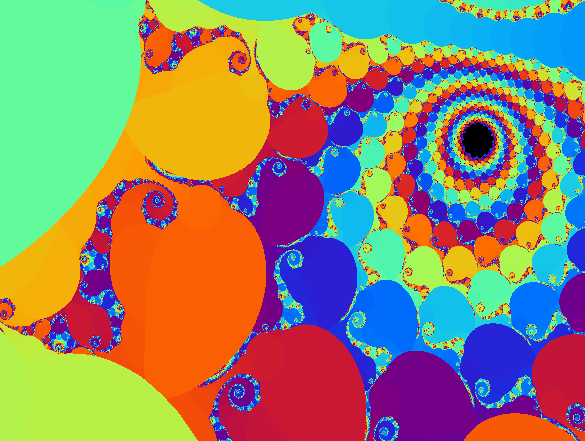
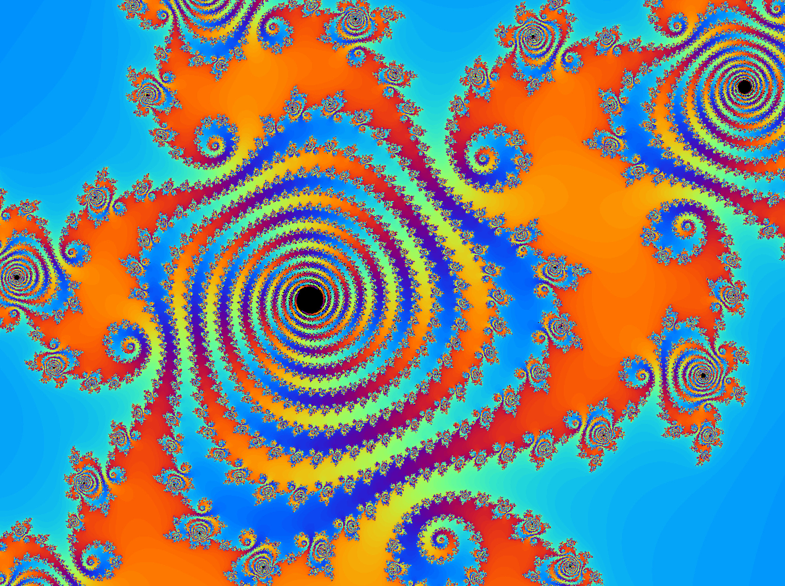

### Fract'ol

by Pablo Alatorre-Troncoso

### Overview

This is a project for 42 USA that asks you to make a fractal navigator letting you browse the Mandelbrot set and any Julia set. Though it asks you to include at least one more fractal, I decided to include several more, most of them variations of the Mandelbrot or the Julia (different exponent, absolute value), but some unique (my mandeljulia is a map of Julias allowing you to browse through many Julias and realize the connection between the Mandelbrot and the Julia sets).

